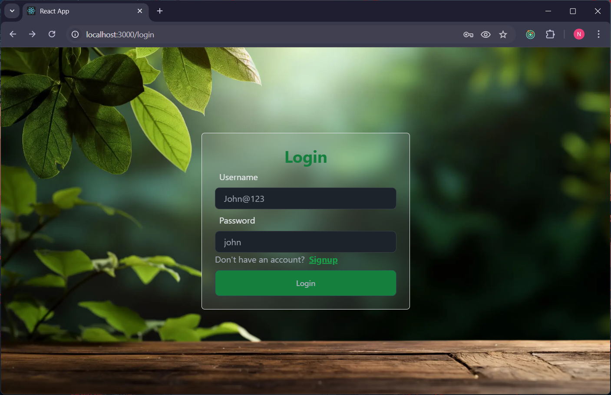
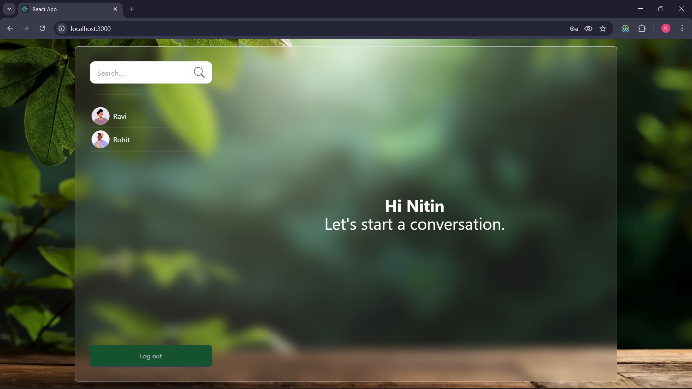
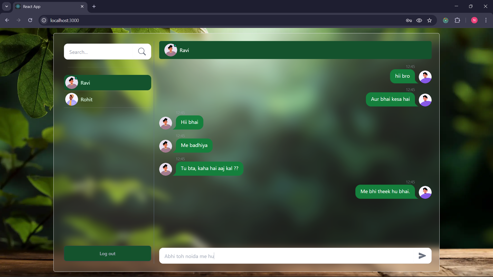
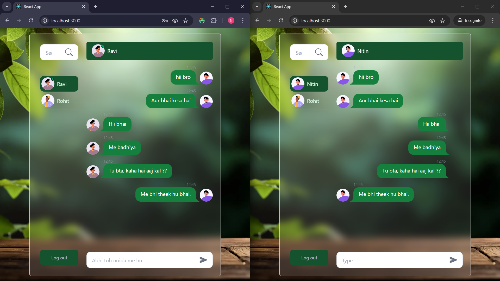

# 💬 Chatting Application

A real-time web chat application built using the **MERN stack** (MongoDB, Express.js, React.js, Node.js). It supports secure one-on-one messaging and group chats with real-time updates using **WebSocket technology**.

---

## 🚀 Features

* 🔒 **JWT Authentication** – Secure login and access control
* 💬 **Real-Time Messaging** – One-to-one chat using **Socket.IO**
* 👥 **Group Chat Support** – Chat with multiple users in real time
* 📱 **Responsive UI** – Modern and clean interface
* 🛡️ **Encrypted User Data** – Stored securely in MongoDB
* 🌐 **RESTful APIs** – Backend APIs for user, chat, and message operations

---

## 🛠️ Tech Stack

**Frontend**

* React.js
* Material-UI
* Axios
* Socket.IO Client

**Backend**

* Node.js
* Express.js
* MongoDB with Mongoose
* JWT for Authentication
* Socket.IO Server

---

## 📸 Screenshots

### 🔐 1. Login Page

A secure login interface where users enter their username and password to access the chat application. It includes authentication validation and smooth UI design.

### 📝 2. Signup Page

New users can create an account by providing their full name, username, password, and selecting their gender. The form includes validation and user-friendly design.

### 👋 3. Welcome Page

After successful login, users are greeted with a clean dashboard showing available contacts and a prompt to start a conversation.

### 💬 4. Chat Interface

Displays the list of users on the left and the active chat window on the right, featuring message bubbles, timestamps, and a typing input box.

### ⚡ 5. Live Chat (Real-Time Messaging)

Demonstrates real-time message exchange between users using Socket.IO, ensuring instant message delivery and live updates.

---

⭐ If you like this project, consider giving it a star on GitHub!
